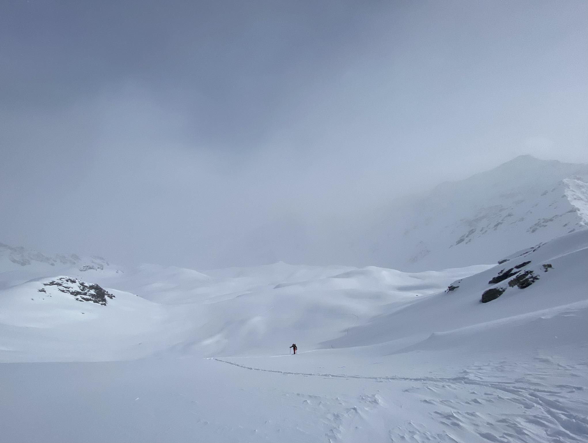
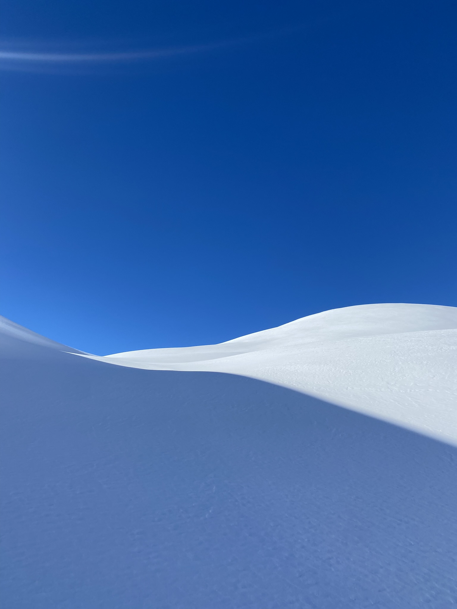
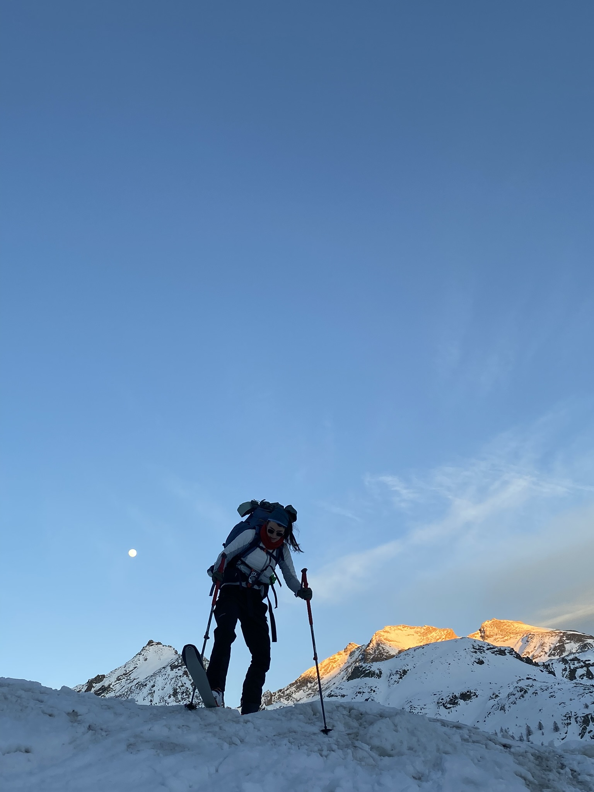
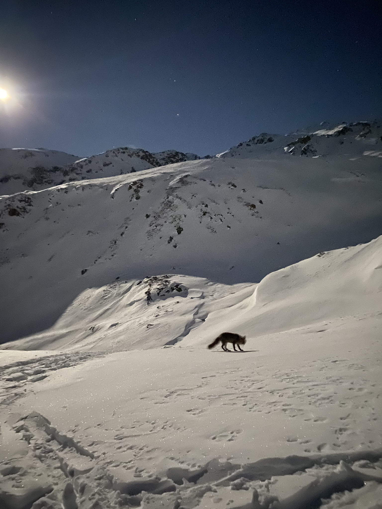
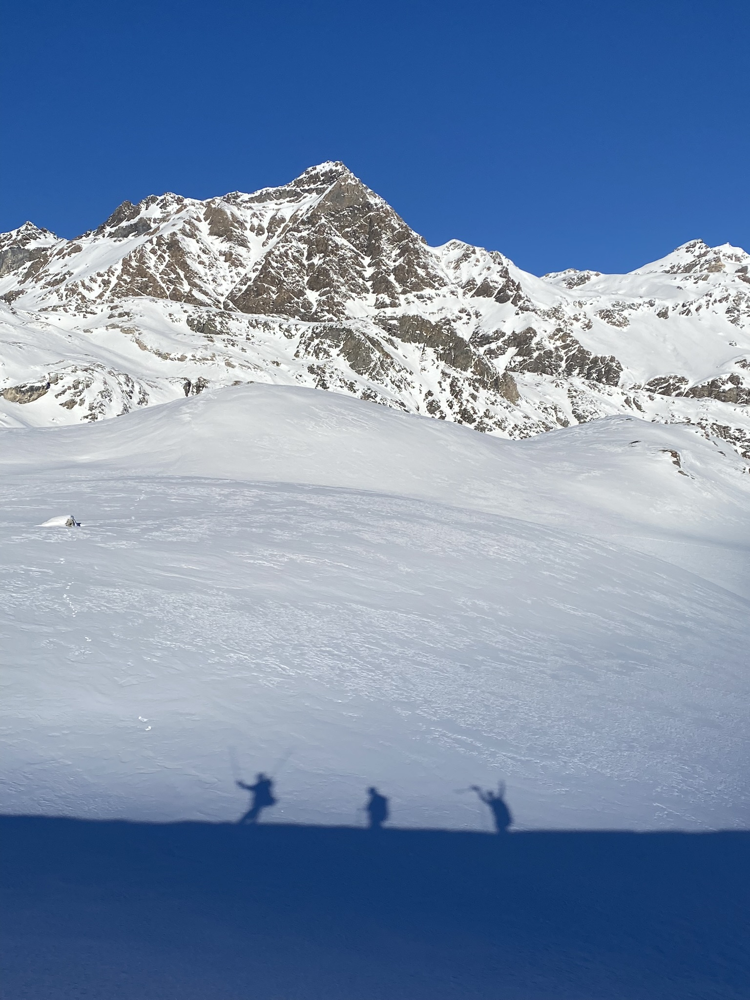
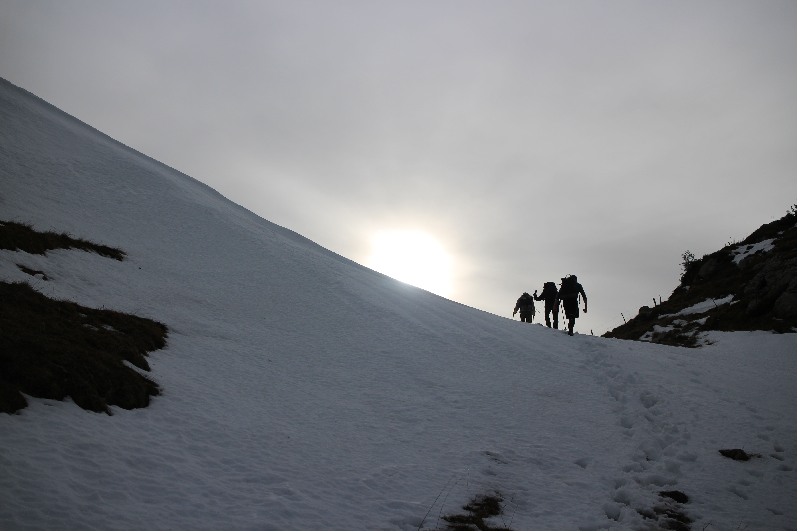
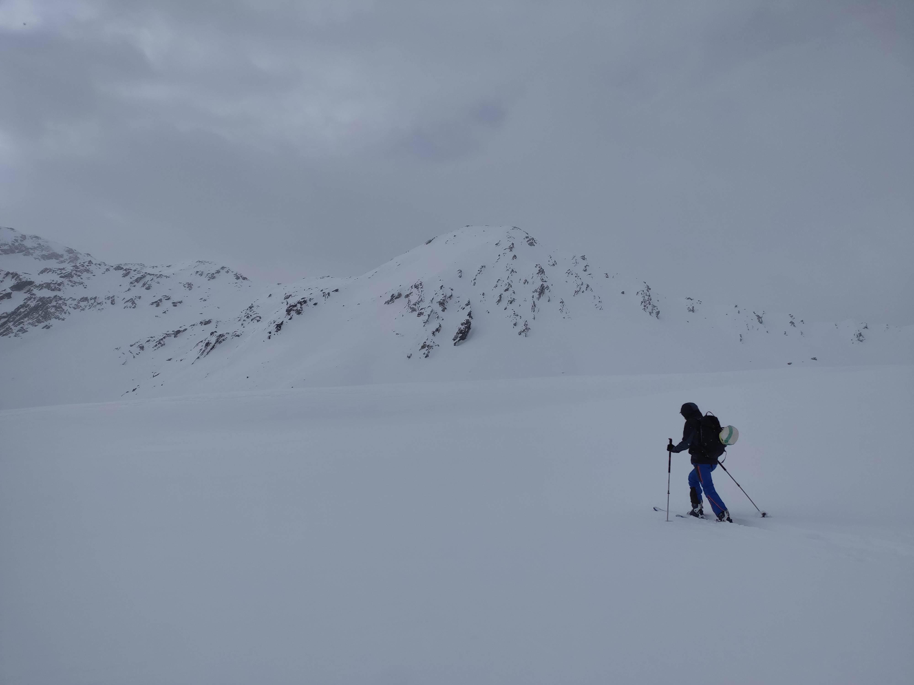

# About the Beauty of Snow

Here are some pictures that I have taken, probably during ski touring sessions. 

I find snowy landscapes to be one of the most calming and powerful views nature has to give. Snow is the illustration of a choc, a contrast, an intersection that is creating this appeasing tension : the danger of the fresh snow and the calm of the winter. It reminds the viewer of its small size, the power of the surroudings is never higher. Yet, a humble passenger will pass, cross the landscapes and leave a trace behind.

