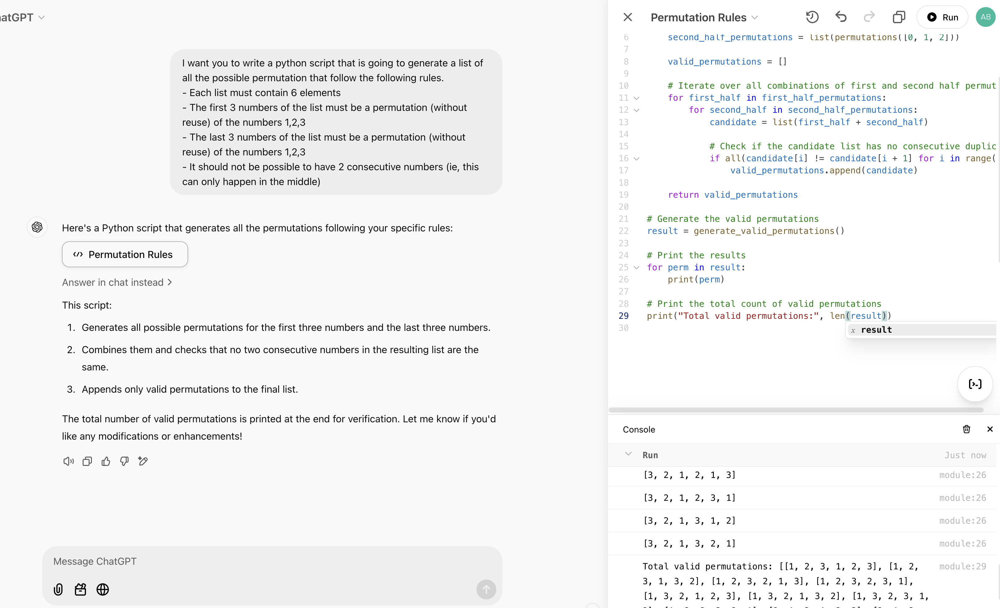

# The Day AI Began Executing Its Self-Written Code

> Or when developers lost the exclusive power to execute code

In the early days of computing, the only code you could execute was the code you wrote yourself.

Eventually, it became possible to execute code written by your friends in the labs next door.

We then gained the ability to run code written by a stranger connected with you on a network.

This network got bigger and bigger, and then came the internet. You could use code from strangers from all over the
world, or code that you bought from a company. This is the moment where documentation became so important: you had to
read it to know how to execute the code.

Continuing forward, things took another turn when people started copying and pasting code from tutorials or answers on
platforms like Stack Overflow. You could run code without truly understanding it. Many developers stopped reading
documentation altogether, especially for straightforward problems.

Fast-forward to just 2 years ago: the game changed entirely when it became possible to copy-paste code generated by an
AI (more specifically a large-language model), into a file in your computer and execute this file.

In the last 2 years, the amount of correction that was required for the AI-generated code to run without bug reduced
drastically. In the winter of 2024, for the first year since the creation of
the [Advent of Code](https://adventofcode.com/2024), AI were very frequently among the top 10 players.

Yet with this ground-breaking gap, it was still only "developers" that had access to the power enabled by being able to
write code and execute it. Hard to find a name for this power, but unarguably something powerful.

Today, I noticed that a new step has been passed: it became to possible to ask an AI to generate your code and ask the
AI to execute it for you !

ChatGPT has enabled a new feature that allows to run python code directly in the browser page where your generated this
code. Not only can you run the code, you also have access to auto-completion to edit it, and integrated AI that helps
you modify it.

I stumbled upon this while trying to help my fiancée to compute some numbers for her psychology research. She's not a
software engineer and for her writing and running a python code is always somehow challenging. So for her, this is
definitely a new step in her ability to have access to computing technologies. In her perspective, she has just gained a
power that up until now was only limited to those designated by the term "developer", who knew (or enjoyed) how to write
code, and more specifically, how to execute it.

As of now, not only don't you need to know how to write code, but you don't even need to know how to execute it.

Of course, skeptics might argue that this is merely an "integration" step—a convenient feature, but not a groundbreaking
scientific achievement like the advent of free, widely accessible LLMs two years ago. And they’d be right. But isn't
that the case for most of the major shifts I’ve described above? Each step built upon the last, making computing easier
and more accessible to a wider audience.

So, what comes next ? What will be the next step defining the history of accessibility to programming technologies ?

Here's my take on this question: **AI will execute their generated code without disclosing it**.

This step will come with unprecedented capabilities—and, inevitably, risks more dangerous than ever before. How humanity
will handle these risks and embrace these advancements remains one of the many open questions only the future can
answer.

And I’ll end this quick article with one final question: have we, as developers, just lost a power that was once
exclusively ours? If so, could it be because we’ve failed to emphasize the ethics of programming? After all, shouldn’t
every great power come with equally great ethical responsibility?
